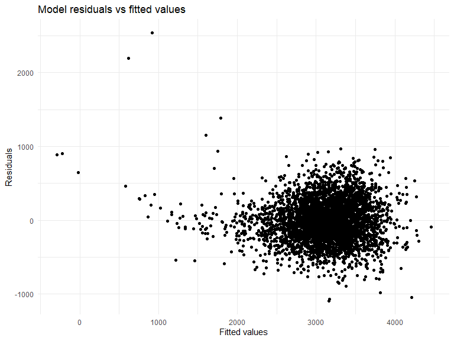

HW6 Solution
================
Zhengwei Song

## Problem 2

## Importing the dataset

``` r
homicide_raw <- read_csv("https://raw.githubusercontent.com/washingtonpost/data-homicides/master/homicide-data.csv")
```

#### Creating a `city_state` variable, binary variable `resolution` indicating case disposition, omitting cities excluded victim race and Tulsa, AL with data entry mistake. Also, limiting `victim_race` is white or black, making `victim_age` numeric.

``` r
homicide_df = homicide_raw %>% 
    janitor::clean_names() %>%
    mutate(
        reported_date = as.Date(as.character(reported_date), format = "%Y%m%d"),
        city_state = str_c(city, state, sep = ", "),
        resolved = as.numeric(disposition == "Closed by arrest"),
        victim_age = as.numeric(victim_age),
        victim_race = fct_relevel(victim_race, "White")
    ) %>%
    relocate(city_state) %>%
    filter(city_state != c("Tulsa, AL","Dallas, TX","Phoenix, AZ","Kansas City, MO"),
           victim_race == c("White","Black"))
```

#### Applying `glm` to fit a logistic regression with resolved vs unresolved as the outcome; victim age, sex and race as predictors. Also, saving the output of `glm` as an R object.

``` r
baltimore_logistic = homicide_df %>%
    filter(city_state == "Baltimore, MD") %>%
    glm(resolved ~ victim_age + victim_race + victim_sex, data = ., family = binomial()) 
```

#### Applying the `broom::tidy` to the above object; Obtaining the estimate and confidence interval of the adjusted odds ratio, for solving homicides comparing male victims to female victims keeping all other variables fixed.

``` r
baltimore_logistic %>% 
  broom::tidy(conf.int = T) %>% 
  mutate(OR = exp(estimate),
         CI_Lower = exp(conf.low),
         CI_Upper = exp(conf.high)) %>%
  select(term, log_OR = estimate, OR,CI_Lower,CI_Upper, p.value) %>% 
  knitr::kable(digits = 3)
```

| term             | log_OR |    OR | CI_Lower | CI_Upper | p.value |
|:-----------------|-------:|------:|---------:|---------:|--------:|
| (Intercept)      |  1.421 | 4.140 |    2.124 |    8.262 |   0.000 |
| victim_age       | -0.011 | 0.989 |    0.980 |    0.999 |   0.027 |
| victim_raceBlack | -0.923 | 0.397 |    0.239 |    0.655 |   0.000 |
| victim_sexMale   | -0.940 | 0.391 |    0.265 |    0.572 |   0.000 |

- Keeping all other variables fixed, in Baltimore, MD, homicides in
  which the victim is male are significantly less like to be resolved
  than those in which the victim is female.

## Running `glm` for each of the cities in the dataset; Extracting the adjusted odds ratio and CI, for solving homicides comparing male victims to female victims;

``` r
allcities_logistic = homicide_df %>% 
  nest(data = -city_state) %>% 
  mutate(
    models = map(data, ~glm(resolved ~ victim_age + victim_race + victim_sex, data = ., family = binomial())),
    results = map(models, ~broom::tidy(.x, conf.int = T))) %>% 
  select(-data, -models) %>% 
  unnest(results)
```

``` r
allcities_logistic %>%
  mutate(term = fct_inorder(term),
         OR = exp(estimate),
         CI_Lower = exp(conf.low),
         CI_Upper = exp(conf.high)
         ) %>%
    select(city_state, term, log_OR = estimate, OR, CI_Lower, CI_Upper,p.value) %>% 
  knitr::kable(digits = 3)
```

| city_state         | term              |  log_OR |     OR | CI_Lower |      CI_Upper | p.value |
|:-------------------|:------------------|--------:|-------:|---------:|--------------:|--------:|
| Albuquerque, NM    | (Intercept)       |   1.162 |  3.196 |    0.922 |  1.265200e+01 |   0.078 |
| Albuquerque, NM    | victim_age        |  -0.025 |  0.975 |    0.947 |  1.002000e+00 |   0.074 |
| Albuquerque, NM    | victim_raceBlack  |  -0.938 |  0.391 |    0.119 |  1.261000e+00 |   0.115 |
| Albuquerque, NM    | victim_sexMale    |   0.736 |  2.088 |    0.693 |  6.359000e+00 |   0.188 |
| Albuquerque, NM    | victim_sexUnknown | -15.002 |  0.000 |       NA | 1.078456e+122 |   0.992 |
| Atlanta, GA        | (Intercept)       |   0.607 |  1.835 |    0.654 |  5.249000e+00 |   0.251 |
| Atlanta, GA        | victim_age        |  -0.016 |  0.984 |    0.971 |  9.970000e-01 |   0.019 |
| Atlanta, GA        | victim_raceBlack  |   0.246 |  1.279 |    0.572 |  2.812000e+00 |   0.541 |
| Atlanta, GA        | victim_sexMale    |   0.296 |  1.344 |    0.797 |  2.248000e+00 |   0.262 |
| Baltimore, MD      | (Intercept)       |   1.421 |  4.140 |    2.124 |  8.262000e+00 |   0.000 |
| Baltimore, MD      | victim_age        |  -0.011 |  0.989 |    0.980 |  9.990000e-01 |   0.027 |
| Baltimore, MD      | victim_raceBlack  |  -0.923 |  0.397 |    0.239 |  6.550000e-01 |   0.000 |
| Baltimore, MD      | victim_sexMale    |  -0.940 |  0.391 |    0.265 |  5.720000e-01 |   0.000 |
| Baton Rouge, LA    | (Intercept)       |   1.728 |  5.629 |    1.306 |  2.735200e+01 |   0.025 |
| Baton Rouge, LA    | victim_age        |  -0.008 |  0.992 |    0.970 |  1.015000e+00 |   0.499 |
| Baton Rouge, LA    | victim_raceBlack  |  -0.217 |  0.805 |    0.249 |  2.463000e+00 |   0.705 |
| Baton Rouge, LA    | victim_sexMale    |  -1.373 |  0.253 |    0.096 |  5.930000e-01 |   0.003 |
| Birmingham, AL     | (Intercept)       |   0.873 |  2.395 |    0.821 |  7.198000e+00 |   0.113 |
| Birmingham, AL     | victim_age        |  -0.003 |  0.997 |    0.982 |  1.011000e+00 |   0.649 |
| Birmingham, AL     | victim_raceBlack  |  -0.253 |  0.776 |    0.360 |  1.632000e+00 |   0.509 |
| Birmingham, AL     | victim_sexMale    |  -0.406 |  0.666 |    0.367 |  1.184000e+00 |   0.172 |
| Boston, MA         | (Intercept)       |   1.877 |  6.532 |    1.541 |  3.485800e+01 |   0.017 |
| Boston, MA         | victim_age        |   0.003 |  1.003 |    0.977 |  1.030000e+00 |   0.830 |
| Boston, MA         | victim_raceBlack  |  -2.183 |  0.113 |    0.031 |  3.210000e-01 |   0.000 |
| Boston, MA         | victim_sexMale    |  -0.068 |  0.934 |    0.401 |  2.199000e+00 |   0.874 |
| Boston, MA         | victim_sexUnknown |  -0.395 |  0.674 |    0.040 |  1.919800e+01 |   0.788 |
| Buffalo, NY        | (Intercept)       |   0.362 |  1.437 |    0.367 |  5.833000e+00 |   0.605 |
| Buffalo, NY        | victim_age        |   0.019 |  1.019 |    0.999 |  1.041000e+00 |   0.070 |
| Buffalo, NY        | victim_raceBlack  |  -0.968 |  0.380 |    0.163 |  8.520000e-01 |   0.020 |
| Buffalo, NY        | victim_sexMale    |  -0.601 |  0.548 |    0.208 |  1.414000e+00 |   0.212 |
| Charlotte, NC      | (Intercept)       |   0.953 |  2.594 |    0.868 |  8.296000e+00 |   0.096 |
| Charlotte, NC      | victim_age        |   0.011 |  1.011 |    0.994 |  1.029000e+00 |   0.223 |
| Charlotte, NC      | victim_raceBlack  |  -0.073 |  0.929 |    0.416 |  1.961000e+00 |   0.851 |
| Charlotte, NC      | victim_sexMale    |  -0.425 |  0.654 |    0.311 |  1.294000e+00 |   0.239 |
| Chicago, IL        | (Intercept)       |   0.172 |  1.188 |    0.720 |  1.957000e+00 |   0.500 |
| Chicago, IL        | victim_age        |   0.003 |  1.003 |    0.996 |  1.011000e+00 |   0.421 |
| Chicago, IL        | victim_raceBlack  |  -0.558 |  0.573 |    0.396 |  8.330000e-01 |   0.003 |
| Chicago, IL        | victim_sexMale    |  -0.923 |  0.397 |    0.301 |  5.250000e-01 |   0.000 |
| Cincinnati, OH     | (Intercept)       |   2.357 | 10.559 |    3.306 |  3.756700e+01 |   0.000 |
| Cincinnati, OH     | victim_age        |  -0.011 |  0.989 |    0.971 |  1.006000e+00 |   0.213 |
| Cincinnati, OH     | victim_raceBlack  |  -0.966 |  0.381 |    0.168 |  8.010000e-01 |   0.015 |
| Cincinnati, OH     | victim_sexMale    |  -1.009 |  0.364 |    0.157 |  7.740000e-01 |   0.012 |
| Columbus, OH       | (Intercept)       |   0.272 |  1.313 |    0.643 |  2.705000e+00 |   0.456 |
| Columbus, OH       | victim_age        |   0.010 |  1.010 |    0.997 |  1.024000e+00 |   0.134 |
| Columbus, OH       | victim_raceBlack  |  -0.164 |  0.849 |    0.552 |  1.305000e+00 |   0.456 |
| Columbus, OH       | victim_sexMale    |  -0.497 |  0.609 |    0.363 |  1.005000e+00 |   0.055 |
| Denver, CO         | (Intercept)       |   1.062 |  2.893 |    0.738 |  1.244000e+01 |   0.136 |
| Denver, CO         | victim_age        |  -0.017 |  0.983 |    0.959 |  1.007000e+00 |   0.174 |
| Denver, CO         | victim_raceBlack  |  -0.258 |  0.772 |    0.329 |  1.795000e+00 |   0.549 |
| Denver, CO         | victim_sexMale    |  -0.351 |  0.704 |    0.231 |  2.073000e+00 |   0.526 |
| Detroit, MI        | (Intercept)       |   0.250 |  1.284 |    0.750 |  2.207000e+00 |   0.364 |
| Detroit, MI        | victim_age        |   0.005 |  1.005 |    0.997 |  1.014000e+00 |   0.223 |
| Detroit, MI        | victim_raceBlack  |  -0.357 |  0.700 |    0.472 |  1.036000e+00 |   0.074 |
| Detroit, MI        | victim_sexMale    |  -0.547 |  0.579 |    0.415 |  8.050000e-01 |   0.001 |
| Durham, NC         | (Intercept)       |   0.978 |  2.660 |    0.527 |  1.634600e+01 |   0.254 |
| Durham, NC         | victim_age        |   0.001 |  1.001 |    0.974 |  1.029000e+00 |   0.968 |
| Durham, NC         | victim_raceBlack  |  -0.056 |  0.946 |    0.219 |  3.630000e+00 |   0.937 |
| Durham, NC         | victim_sexMale    |  -0.342 |  0.710 |    0.199 |  2.207000e+00 |   0.570 |
| Fort Worth, TX     | (Intercept)       |   1.541 |  4.671 |    1.666 |  1.391600e+01 |   0.004 |
| Fort Worth, TX     | victim_age        |  -0.027 |  0.974 |    0.956 |  9.910000e-01 |   0.003 |
| Fort Worth, TX     | victim_raceBlack  |  -0.312 |  0.732 |    0.392 |  1.348000e+00 |   0.321 |
| Fort Worth, TX     | victim_sexMale    |  -0.344 |  0.709 |    0.353 |  1.395000e+00 |   0.324 |
| Fresno, CA         | (Intercept)       |   0.969 |  2.637 |    0.445 |  1.818500e+01 |   0.299 |
| Fresno, CA         | victim_age        |   0.018 |  1.018 |    0.989 |  1.052000e+00 |   0.236 |
| Fresno, CA         | victim_raceBlack  |  -1.387 |  0.250 |    0.065 |  7.720000e-01 |   0.025 |
| Fresno, CA         | victim_sexMale    |   0.411 |  1.509 |    0.407 |  5.281000e+00 |   0.520 |
| Houston, TX        | (Intercept)       |   0.864 |  2.373 |    1.393 |  4.082000e+00 |   0.002 |
| Houston, TX        | victim_age        |  -0.005 |  0.995 |    0.987 |  1.004000e+00 |   0.260 |
| Houston, TX        | victim_raceBlack  |  -0.134 |  0.875 |    0.625 |  1.222000e+00 |   0.434 |
| Houston, TX        | victim_sexMale    |  -0.637 |  0.529 |    0.370 |  7.500000e-01 |   0.000 |
| Indianapolis, IN   | (Intercept)       |   0.983 |  2.674 |    1.410 |  5.165000e+00 |   0.003 |
| Indianapolis, IN   | victim_age        |  -0.008 |  0.992 |    0.981 |  1.004000e+00 |   0.177 |
| Indianapolis, IN   | victim_raceBlack  |  -0.660 |  0.517 |    0.346 |  7.660000e-01 |   0.001 |
| Indianapolis, IN   | victim_sexMale    |  -0.041 |  0.960 |    0.621 |  1.476000e+00 |   0.852 |
| Jacksonville, FL   | (Intercept)       |   1.323 |  3.756 |    2.016 |  7.180000e+00 |   0.000 |
| Jacksonville, FL   | victim_age        |  -0.012 |  0.988 |    0.977 |  1.000000e+00 |   0.047 |
| Jacksonville, FL   | victim_raceBlack  |  -0.623 |  0.536 |    0.363 |  7.890000e-01 |   0.002 |
| Jacksonville, FL   | victim_sexMale    |  -0.700 |  0.497 |    0.321 |  7.610000e-01 |   0.001 |
| Las Vegas, NV      | (Intercept)       |   0.949 |  2.583 |    1.363 |  4.997000e+00 |   0.004 |
| Las Vegas, NV      | victim_age        |  -0.005 |  0.995 |    0.984 |  1.006000e+00 |   0.339 |
| Las Vegas, NV      | victim_raceBlack  |  -0.273 |  0.761 |    0.500 |  1.153000e+00 |   0.199 |
| Las Vegas, NV      | victim_sexMale    |  -0.142 |  0.868 |    0.540 |  1.379000e+00 |   0.552 |
| Long Beach, CA     | (Intercept)       |   3.228 | 25.240 |    2.941 |  3.884690e+02 |   0.009 |
| Long Beach, CA     | victim_age        |  -0.015 |  0.985 |    0.953 |  1.018000e+00 |   0.368 |
| Long Beach, CA     | victim_raceBlack  |  -0.961 |  0.383 |    0.084 |  1.427000e+00 |   0.176 |
| Long Beach, CA     | victim_sexMale    |  -1.468 |  0.230 |    0.034 |  9.280000e-01 |   0.067 |
| Los Angeles, CA    | (Intercept)       |   0.819 |  2.269 |    1.067 |  4.918000e+00 |   0.035 |
| Los Angeles, CA    | victim_age        |  -0.003 |  0.997 |    0.985 |  1.009000e+00 |   0.589 |
| Los Angeles, CA    | victim_raceBlack  |  -0.427 |  0.652 |    0.403 |  1.049000e+00 |   0.079 |
| Los Angeles, CA    | victim_sexMale    |  -0.504 |  0.604 |    0.363 |  9.960000e-01 |   0.050 |
| Louisville, KY     | (Intercept)       |   1.846 |  6.335 |    2.442 |  1.767400e+01 |   0.000 |
| Louisville, KY     | victim_age        |  -0.012 |  0.988 |    0.970 |  1.005000e+00 |   0.162 |
| Louisville, KY     | victim_raceBlack  |  -0.734 |  0.480 |    0.262 |  8.610000e-01 |   0.015 |
| Louisville, KY     | victim_sexMale    |  -0.792 |  0.453 |    0.221 |  8.870000e-01 |   0.024 |
| Memphis, TN        | (Intercept)       |   1.746 |  5.733 |    2.605 |  1.305300e+01 |   0.000 |
| Memphis, TN        | victim_age        |  -0.015 |  0.985 |    0.974 |  9.960000e-01 |   0.007 |
| Memphis, TN        | victim_raceBlack  |  -0.139 |  0.870 |    0.487 |  1.512000e+00 |   0.630 |
| Memphis, TN        | victim_sexMale    |  -0.351 |  0.704 |    0.448 |  1.081000e+00 |   0.117 |
| Miami, FL          | (Intercept)       |   0.859 |  2.360 |    0.834 |  6.944000e+00 |   0.110 |
| Miami, FL          | victim_age        |  -0.007 |  0.993 |    0.974 |  1.012000e+00 |   0.492 |
| Miami, FL          | victim_raceBlack  |  -0.594 |  0.552 |    0.297 |  1.022000e+00 |   0.058 |
| Miami, FL          | victim_sexMale    |  -0.891 |  0.410 |    0.199 |  8.340000e-01 |   0.014 |
| Milwaukee, wI      | (Intercept)       |   1.888 |  6.609 |    2.733 |  1.703400e+01 |   0.000 |
| Milwaukee, wI      | victim_age        |  -0.013 |  0.987 |    0.974 |  9.990000e-01 |   0.042 |
| Milwaukee, wI      | victim_raceBlack  |  -0.695 |  0.499 |    0.243 |  9.660000e-01 |   0.047 |
| Milwaukee, wI      | victim_sexMale    |  -0.404 |  0.668 |    0.398 |  1.096000e+00 |   0.117 |
| Minneapolis, MN    | (Intercept)       |   0.437 |  1.548 |    0.351 |  7.195000e+00 |   0.566 |
| Minneapolis, MN    | victim_age        |  -0.005 |  0.995 |    0.973 |  1.018000e+00 |   0.664 |
| Minneapolis, MN    | victim_raceBlack  |  -0.869 |  0.419 |    0.148 |  1.094000e+00 |   0.085 |
| Minneapolis, MN    | victim_sexMale    |   0.549 |  1.731 |    0.677 |  4.647000e+00 |   0.259 |
| Nashville, TN      | (Intercept)       |   0.858 |  2.359 |    1.079 |  5.346000e+00 |   0.035 |
| Nashville, TN      | victim_age        |  -0.007 |  0.993 |    0.978 |  1.007000e+00 |   0.319 |
| Nashville, TN      | victim_raceBlack  |   0.020 |  1.020 |    0.640 |  1.614000e+00 |   0.934 |
| Nashville, TN      | victim_sexMale    |  -0.086 |  0.918 |    0.479 |  1.706000e+00 |   0.790 |
| New Orleans, LA    | (Intercept)       |   1.135 |  3.113 |    1.314 |  7.511000e+00 |   0.010 |
| New Orleans, LA    | victim_age        |  -0.019 |  0.981 |    0.967 |  9.950000e-01 |   0.007 |
| New Orleans, LA    | victim_raceBlack  |  -0.631 |  0.532 |    0.289 |  9.820000e-01 |   0.042 |
| New Orleans, LA    | victim_sexMale    |  -0.622 |  0.537 |    0.340 |  8.480000e-01 |   0.007 |
| New York, NY       | (Intercept)       |   2.927 | 18.678 |    4.004 |  1.100630e+02 |   0.000 |
| New York, NY       | victim_age        |   0.007 |  1.007 |    0.985 |  1.029000e+00 |   0.535 |
| New York, NY       | victim_raceBlack  |  -1.259 |  0.284 |    0.095 |  7.430000e-01 |   0.015 |
| New York, NY       | victim_sexMale    |  -2.069 |  0.126 |    0.036 |  3.400000e-01 |   0.000 |
| Oakland, CA        | (Intercept)       |   2.029 |  7.609 |    2.196 |  3.041700e+01 |   0.002 |
| Oakland, CA        | victim_age        |   0.001 |  1.001 |    0.984 |  1.018000e+00 |   0.887 |
| Oakland, CA        | victim_raceBlack  |  -1.882 |  0.152 |    0.049 |  3.900000e-01 |   0.000 |
| Oakland, CA        | victim_sexMale    |  -0.705 |  0.494 |    0.264 |  9.150000e-01 |   0.026 |
| Oklahoma City, OK  | (Intercept)       |   0.788 |  2.199 |    0.959 |  5.193000e+00 |   0.066 |
| Oklahoma City, OK  | victim_age        |  -0.008 |  0.992 |    0.976 |  1.009000e+00 |   0.372 |
| Oklahoma City, OK  | victim_raceBlack  |  -0.642 |  0.526 |    0.293 |  9.300000e-01 |   0.029 |
| Oklahoma City, OK  | victim_sexMale    |  -0.001 |  0.999 |    0.506 |  1.966000e+00 |   0.998 |
| Omaha, NE          | (Intercept)       |   2.322 | 10.201 |    2.581 |  4.563300e+01 |   0.001 |
| Omaha, NE          | victim_age        |   0.006 |  1.006 |    0.981 |  1.031000e+00 |   0.643 |
| Omaha, NE          | victim_raceBlack  |  -2.082 |  0.125 |    0.050 |  2.800000e-01 |   0.000 |
| Omaha, NE          | victim_sexMale    |  -1.041 |  0.353 |    0.139 |  8.460000e-01 |   0.023 |
| Philadelphia, PA   | (Intercept)       |   1.053 |  2.867 |    1.610 |  5.182000e+00 |   0.000 |
| Philadelphia, PA   | victim_age        |   0.002 |  1.002 |    0.993 |  1.010000e+00 |   0.678 |
| Philadelphia, PA   | victim_raceBlack  |  -0.341 |  0.711 |    0.476 |  1.053000e+00 |   0.092 |
| Philadelphia, PA   | victim_sexMale    |  -0.679 |  0.507 |    0.352 |  7.220000e-01 |   0.000 |
| Pittsburgh, PA     | (Intercept)       |   1.284 |  3.611 |    1.303 |  1.076400e+01 |   0.016 |
| Pittsburgh, PA     | victim_age        |   0.003 |  1.003 |    0.986 |  1.020000e+00 |   0.707 |
| Pittsburgh, PA     | victim_raceBlack  |  -1.201 |  0.301 |    0.132 |  6.380000e-01 |   0.003 |
| Pittsburgh, PA     | victim_sexMale    |  -0.555 |  0.574 |    0.302 |  1.077000e+00 |   0.086 |
| Richmond, VA       | (Intercept)       |   1.820 |  6.175 |    0.892 |  5.245500e+01 |   0.076 |
| Richmond, VA       | victim_age        |  -0.015 |  0.985 |    0.956 |  1.016000e+00 |   0.337 |
| Richmond, VA       | victim_raceBlack  |  -0.036 |  0.964 |    0.242 |  3.222000e+00 |   0.955 |
| Richmond, VA       | victim_sexMale    |  -0.340 |  0.712 |    0.219 |  1.963000e+00 |   0.535 |
| San Antonio, TX    | (Intercept)       |   1.370 |  3.936 |    1.228 |  1.358500e+01 |   0.024 |
| San Antonio, TX    | victim_age        |  -0.021 |  0.980 |    0.960 |  9.990000e-01 |   0.043 |
| San Antonio, TX    | victim_raceBlack  |  -0.148 |  0.863 |    0.431 |  1.702000e+00 |   0.673 |
| San Antonio, TX    | victim_sexMale    |  -0.296 |  0.744 |    0.331 |  1.617000e+00 |   0.462 |
| Sacramento, CA     | (Intercept)       |   0.622 |  1.863 |    0.462 |  7.877000e+00 |   0.385 |
| Sacramento, CA     | victim_age        |   0.012 |  1.012 |    0.986 |  1.040000e+00 |   0.376 |
| Sacramento, CA     | victim_raceBlack  |  -0.364 |  0.695 |    0.276 |  1.694000e+00 |   0.428 |
| Sacramento, CA     | victim_sexMale    |  -0.449 |  0.638 |    0.246 |  1.572000e+00 |   0.338 |
| Sacramento, CA     | victim_sexUnknown | -16.096 |  0.000 |       NA | 5.462216e+121 |   0.991 |
| Savannah, GA       | (Intercept)       |   0.194 |  1.214 |    0.233 |  6.546000e+00 |   0.818 |
| Savannah, GA       | victim_age        |   0.017 |  1.017 |    0.989 |  1.048000e+00 |   0.242 |
| Savannah, GA       | victim_raceBlack  |  -0.266 |  0.766 |    0.257 |  2.241000e+00 |   0.625 |
| Savannah, GA       | victim_sexMale    |  -0.624 |  0.536 |    0.180 |  1.499000e+00 |   0.243 |
| San Bernardino, CA | (Intercept)       |  -1.631 |  0.196 |    0.016 |  1.974000e+00 |   0.175 |
| San Bernardino, CA | victim_age        |   0.039 |  1.040 |    1.003 |  1.083000e+00 |   0.042 |
| San Bernardino, CA | victim_raceBlack  |   0.370 |  1.447 |    0.419 |  5.393000e+00 |   0.565 |
| San Bernardino, CA | victim_sexMale    |  -0.318 |  0.728 |    0.179 |  2.889000e+00 |   0.647 |
| San Diego, CA      | (Intercept)       |   2.023 |  7.561 |    1.607 |  4.162800e+01 |   0.014 |
| San Diego, CA      | victim_age        |  -0.011 |  0.989 |    0.966 |  1.013000e+00 |   0.380 |
| San Diego, CA      | victim_raceBlack  |  -0.502 |  0.605 |    0.263 |  1.360000e+00 |   0.229 |
| San Diego, CA      | victim_sexMale    |  -1.042 |  0.353 |    0.118 |  9.210000e-01 |   0.043 |
| San Francisco, CA  | (Intercept)       |   1.020 |  2.772 |    0.728 |  1.190600e+01 |   0.148 |
| San Francisco, CA  | victim_age        |   0.017 |  1.017 |    0.997 |  1.037000e+00 |   0.092 |
| San Francisco, CA  | victim_raceBlack  |  -0.855 |  0.425 |    0.212 |  8.300000e-01 |   0.014 |
| San Francisco, CA  | victim_sexMale    |  -0.910 |  0.403 |    0.125 |  1.111000e+00 |   0.096 |
| St. Louis, MO      | (Intercept)       |   0.518 |  1.678 |    0.835 |  3.401000e+00 |   0.148 |
| St. Louis, MO      | victim_age        |  -0.001 |  0.999 |    0.988 |  1.010000e+00 |   0.881 |
| St. Louis, MO      | victim_raceBlack  |  -0.344 |  0.709 |    0.436 |  1.147000e+00 |   0.161 |
| St. Louis, MO      | victim_sexMale    |  -0.445 |  0.641 |    0.437 |  9.360000e-01 |   0.022 |
| Stockton, CA       | (Intercept)       |   1.423 |  4.150 |    0.860 |  2.290000e+01 |   0.085 |
| Stockton, CA       | victim_age        |  -0.021 |  0.979 |    0.952 |  1.005000e+00 |   0.125 |
| Stockton, CA       | victim_raceBlack  |  -1.412 |  0.244 |    0.079 |  6.730000e-01 |   0.009 |
| Stockton, CA       | victim_sexMale    |   0.165 |  1.180 |    0.374 |  3.832000e+00 |   0.778 |
| Tampa, FL          | (Intercept)       |   0.215 |  1.240 |    0.178 |  9.662000e+00 |   0.829 |
| Tampa, FL          | victim_age        |   0.018 |  1.019 |    0.988 |  1.052000e+00 |   0.243 |
| Tampa, FL          | victim_raceBlack  |   0.041 |  1.042 |    0.323 |  3.443000e+00 |   0.945 |
| Tampa, FL          | victim_sexMale    |  -1.156 |  0.315 |    0.061 |  1.284000e+00 |   0.124 |
| Tulsa, OK          | (Intercept)       |   1.554 |  4.732 |    2.134 |  1.116200e+01 |   0.000 |
| Tulsa, OK          | victim_age        |  -0.008 |  0.992 |    0.976 |  1.009000e+00 |   0.359 |
| Tulsa, OK          | victim_raceBlack  |  -0.364 |  0.695 |    0.389 |  1.226000e+00 |   0.213 |
| Tulsa, OK          | victim_sexMale    |  -0.253 |  0.776 |    0.391 |  1.489000e+00 |   0.456 |
| Washington, DC     | (Intercept)       |   1.193 |  3.296 |    1.109 |  1.038900e+01 |   0.035 |
| Washington, DC     | victim_age        |  -0.003 |  0.997 |    0.986 |  1.009000e+00 |   0.643 |
| Washington, DC     | victim_raceBlack  |  -0.503 |  0.605 |    0.236 |  1.445000e+00 |   0.270 |
| Washington, DC     | victim_sexMale    |  -0.552 |  0.576 |    0.336 |  9.660000e-01 |   0.040 |
| Washington, DC     | victim_sexUnknown |   0.171 |  1.187 |    0.381 |  4.144000e+00 |   0.775 |

- Keeping all other variables fixed, in XXX,XXX,XXX, homicides in which
  the victim is male are significantly less like to be resolved than
  those in which the victim is female.

``` r
allcities_logistic %>% 
  filter(str_detect(term, "victim_sex")) %>% 
  ggplot(aes(x = city_state, y = exp(estimate))) + 
  geom_point() + 
  facet_wrap(~term) + 
  theme(axis.text.x = element_text(angle = 80, hjust = 1))
```


## Problem 3

#### Loading and cleaning the data

``` r
birthweight_raw = read_csv("./data/birthweight.csv")

birthweight_df = birthweight_raw %>% 
    janitor::clean_names() %>%
    mutate(
        across(.cols = c(babysex, frace, malform, mrace), as.factor)
        ) %>%
  mutate(
      babysex = ifelse(babysex == "1", "male","female"),
      malform = ifelse(malform == "0", "absent","present"),
      frace = recode(frace, "1" = "White", "2" = "Black", "3" = "Asian", "4" = "Puerto Rican", "8" = "Other", "9" = "Unknown"),
      mrace = recode(mrace, "1" = "White", "2" = "Black", "3" = "Asian", "4" = "Puerto Rican", "8" = "Other")
         )
```

- `babysex`,`frace`,`malform` and `mrace` were converted from numeric to
  factor, because they are categorical variables.

- These categorical data were applied `recode` to make it more
  intuitive.

#### Missing data check

``` r
skimr::skim(birthweight_df)[c(2,4)] %>% t() %>% knitr::kable()
```

|               |         |         |       |       |       |         |     |       |         |         |          |         |        |        |         |         |       |      |        |        |
|:--------------|:--------|:--------|:------|:------|:------|:--------|:----|:------|:--------|:--------|:---------|:--------|:-------|:-------|:--------|:--------|:------|:-----|:-------|:-------|
| skim_variable | babysex | malform | frace | mrace | bhead | blength | bwt | delwt | fincome | gaweeks | menarche | mheight | momage | parity | pnumlbw | pnumsga | ppbmi | ppwt | smoken | wtgain |
| complete_rate | 1       | 1       | 1     | 1     | 1     | 1       | 1   | 1     | 1       | 1       | 1        | 1       | 1      | 1      | 1       | 1       | 1     | 1    | 1      | 1      |

- There is no missing data. The cleaned dataset contains 4342
  observations and 20 variables: babysex, bhead, blength, bwt, delwt,
  fincome, frace, gaweeks, malform, menarche, mheight, momage, mrace,
  parity, pnumlbw, pnumsga, ppbmi, ppwt, smoken, wtgain

#### The Correlations with Birth Weight

``` r
birthweight_raw %>% 
  cor_mat() %>%
  cor_gather() %>%
  filter(var1 %in% "bwt") %>%
  filter(!var2 %in% "bwt") %>%
  mutate(
    sig_p = ifelse(p < 0.01, T, F),
    cor_if_sig = ifelse(p < 0.01, cor, NA)
    ) %>% 
  ggplot(aes(
    x = var1, 
    y = var2, 
    fill = cor,
    label = round(cor_if_sig, 2))) + 
  geom_tile(color = "white") +   
  geom_text(
    color = "white",
    size = 4
  ) + 
  scale_x_discrete(
    labels = c("Birth Weight")
  ) + 
  labs(
    x = "Outcome",
    y = "Predictors",
    title = "Correlations between predictors and outcome",
    subtitle = "significant predictors at significance level 0.01",
    fill = "Correlation"
  )
```


- Based on t-test, the variables with p-value less than 0.01 are to be
  selected as potential predictors. To be simple, the continuous are to
  be selected.

#### Based on the correlation plot, and intuitively, `babysex`, `bhead`, `gaweeks`, `blength`, `wtgain`, `ppwt` are to be included as potential predictors; Hence we can build models on every subsets of these variables and choose the optimal one with the lowest BIC.

``` r
# find all possible subsets of variables
subsets = unlist(lapply(1:6, combn, x = c("babysex", "bhead", "blength", "wtgain", "ppwt","gaweeks"),  simplify = F), recursive = F)

calc_BIC = function(variables){
  
    formula = as.formula(paste("bwt", paste(variables, collapse = " + "), sep = "~"))
  
    model = lm(formula, birthweight_df)
  return(broom::glance(model) %>% pull("BIC"))
}

# calculate BIC value of every model
BICs = map(subsets, calc_BIC) %>% as_vector()

# choose model with the lowest BIC
index = which(BICs == min(BICs))[[1]]
variables = subsets[[index]]
formula = as.formula(paste("bwt", paste(variables, collapse = " + "), sep = "~"))
fit_optimal = lm(formula, birthweight_df)

birthweight_df %>% 
  add_residuals(fit_optimal) %>% 
  add_predictions(fit_optimal) %>% 
  ggplot(aes(x = pred, y =resid)) +
  geom_point() +
  labs(
    x = "Fitted values",
    y = "Residuals",
    title = "Model residuals vs fitted values"
  )
```



#### Collinearity Check for continuous variables

``` r
selected_variables =
  birthweight_df %>%
  select(bhead, blength, gaweeks, wtgain, ppwt, bwt)

chart.Correlation(selected_variables, method = "pearson")
```


- From the plot, among predictors, `bhead` vs `blength` or `gaweeks`,
  `blength` vs `gaweeks` showed a potential collinearity.

#### Final selection of continuous predictors, and intuitively, we can also include `babysex`.

``` r
selected_variables =
  birthweight_df %>%
  select(bhead, blength, gaweeks, bwt, babysex, mrace, wtgain, ppwt)
```

#### Fitting the linear model with finally selected predictors

``` r
fit_final <- lm(bwt ~ bhead + blength + gaweeks + babysex + mrace + wtgain + ppwt+ bhead:blength +
             bhead:blength:gaweeks, 
           data = selected_variables)
summary(fit_final) %>% 
  broom::tidy() %>%
  select(term, estimate, p.value)
```

    ## # A tibble: 12 × 3
    ##    term                    estimate  p.value
    ##    <chr>                      <dbl>    <dbl>
    ##  1 (Intercept)           -2295.     7.74e- 3
    ##  2 bhead                   -19.0    6.06e- 1
    ##  3 blength                 -27.3    2.76e- 1
    ##  4 gaweeks                  50.3    8.05e- 4
    ##  5 babysexmale             -35.4    3.49e- 5
    ##  6 mraceBlack             -127.     1.15e-44
    ##  7 mraceAsian              -54.1    2.04e- 1
    ##  8 mracePuerto Rican      -107.     1.11e- 8
    ##  9 wtgain                    3.99   6.34e-24
    ## 10 ppwt                      1.65   1.56e-14
    ## 11 bhead:blength             4.04   1.05e- 4
    ## 12 bhead:blength:gaweeks    -0.0236 9.33e- 3

``` r
summary(fit_final) %>% 
  broom::glance()
```

    ## # A tibble: 1 × 8
    ##   r.squared adj.r.squared sigma statistic p.value    df df.residual  nobs
    ##       <dbl>         <dbl> <dbl>     <dbl>   <dbl> <dbl>       <int> <dbl>
    ## 1     0.713         0.713  275.      980.       0    11        4330  4342

#### Residual plot

``` r
selected_variables %>%
  add_residuals(fit_final) %>%
  add_predictions(fit_final) %>%
  ggplot(aes(x = pred, y = resid)) +
  geom_point() +
  geom_smooth(method = "lm", se = FALSE) +
  labs(title = "Plot of the model residuals against fitted values",
       x = "Fitted Values", y = "Residuals") +
  theme(plot.title = element_text(hjust = 0.5, face = "bold"))
```


#### Comparison in terms of the cross-validated prediction error

``` r
set.seed(2022)
cv_dataset = selected_variables %>%
    crossv_mc(n = 100,test = 0.2)
  
cv_df = cv_dataset %>%
    mutate(
        train = map(train, as_tibble),
        test = map(test, as_tibble))

cv_df = cv_df %>%
    mutate(
        linear_mod1  = map(train, ~lm(bwt ~ bhead + blength + gaweeks + babysex + mrace+ wtgain + ppwt + bhead:blength + bhead:blength:gaweeks, data = .x)),
        linear_mod2  = map(train, ~lm(bwt ~ blength + gaweeks, data = .x)),
        linear_mod3  = map(train, ~lm(bwt ~ bhead + blength + babysex, data = .x))) %>%
    mutate(
        rmse_my_model = map2_dbl(linear_mod1, test, ~rmse(model = .x, data = .y)),
        rmse_given_model1 = map2_dbl(linear_mod2, test, ~rmse(model = .x, data = .y)),
        rmse_given_model2 = map2_dbl(linear_mod3, test, ~rmse(model = .x, data = .y)))
```

#### Root Mean Square Error in the three models

``` r
cv_df %>% 
    select(starts_with("rmse")) %>% 
    pivot_longer(
    everything(),
    names_to = "model", 
    values_to = "rmse",
    names_prefix = "rmse_") %>% 
    mutate(model = fct_inorder(model)) %>% 
    ggplot(aes(x = model, y = rmse)) + 
    geom_boxplot() +
    labs(title = "Prediction Error Distributions across Models", x = "Models", y = "Root Mean Square Error")+
    scale_x_discrete(
        labels = c("My Model", "Given Model 1", "Given Model 2")) +
    theme(plot.title = element_text(hjust = 0.5, face = "bold"))
```


- Based on cross-validation, my model has the relatively lowest root
  mean square error and therefore my model works better. While the first
  given model with predictors **length at birth** and **gestational
  age** has the highest cross-validated RMSE.
