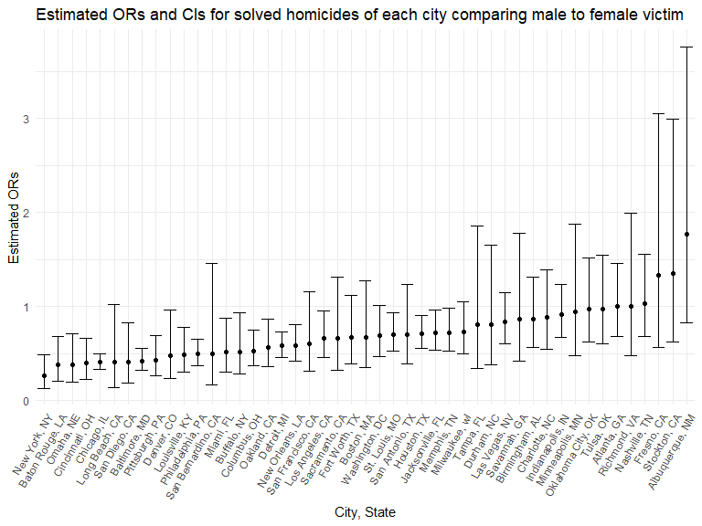

HW6 Solution
================
Zhengwei Song

## Problem 1

To obtain a distribution for $\hat{r}^2$, we’ll follow basically the
same procedure we used for regression coefficients: draw bootstrap
samples; the a model to each; extract the value I’m concerned with; and
summarize. Here, we’ll use `modelr::bootstrap` to draw the samples and
`broom::glance` to produce `r.squared` values.

``` r
weather_df = 
  rnoaa::meteo_pull_monitors(
    c("USW00094728"),
    var = c("PRCP", "TMIN", "TMAX"), 
    date_min = "2017-01-01",
    date_max = "2017-12-31") %>%
  mutate(
    name = recode(id, USW00094728 = "CentralPark_NY"),
    tmin = tmin / 10,
    tmax = tmax / 10) %>%
  select(name, id, everything())
```

    ## Registered S3 method overwritten by 'hoardr':
    ##   method           from
    ##   print.cache_info httr

    ## file min/max dates: 1869-01-01 / 2022-11-30

``` r
weather_df %>% 
  modelr::bootstrap(n = 1000) %>% 
  mutate(
    models = map(strap, ~lm(tmax ~ tmin, data = .x) ),
    results = map(models, broom::glance)) %>% 
  select(-strap, -models) %>% 
  unnest(results) %>% 
  ggplot(aes(x = r.squared)) + geom_density()
```


In this example, the $\hat{r}^2$ value is high, and the upper bound at 1
may be a cause for the generally skewed shape of the distribution. If we
wanted to construct a confidence interval for $R^2$, we could take the
2.5% and 97.5% quantiles of the estimates across bootstrap samples.
However, because the shape isn’t symmetric, using the mean +/- 1.96
times the standard error probably wouldn’t work well.

We can produce a distribution for $\log(\beta_0 * \beta1)$ using a
similar approach, with a bit more wrangling before we make our plot.

``` r
weather_df %>% 
  modelr::bootstrap(n = 1000) %>% 
  mutate(
    models = map(strap, ~lm(tmax ~ tmin, data = .x) ),
    results = map(models, broom::tidy)) %>% 
  select(-strap, -models) %>% 
  unnest(results) %>% 
  select(id = `.id`, term, estimate) %>% 
  pivot_wider(
    names_from = term, 
    values_from = estimate) %>% 
  rename(beta0 = `(Intercept)`, beta1 = tmin) %>% 
  mutate(log_b0b1 = log(beta0 * beta1)) %>% 
  ggplot(aes(x = log_b0b1)) + geom_density()
```


As with $r^2$, this distribution is somewhat skewed and has some
outliers.

The point of this is not to say you should always use the bootstrap –
it’s possible to establish “large sample” distributions for strange
parameters / values / summaries in a lot of cases, and those are great
to have. But it is helpful to know that there’s a way to do inference
even in tough cases.

## Problem 2

## Importing the dataset

``` r
homicide_raw <- read_csv("https://raw.githubusercontent.com/washingtonpost/data-homicides/master/homicide-data.csv")
```

#### Creating a `city_state` variable, binary variable `resolution` indicating case disposition, omitting cities excluded victim race and Tulsa, AL with data entry mistake. Also, limiting `victim_race` is white or black, making `victim_age` numeric.

``` r
homicide_df = homicide_raw %>% 
    janitor::clean_names() %>%
    mutate(
        reported_date = as.Date(as.character(reported_date), format = "%Y%m%d"),
        city_state = str_c(city, state, sep = ", "),
        resolved = as.numeric(disposition == "Closed by arrest"),
        victim_age = as.numeric(victim_age),
        victim_race = fct_relevel(victim_race, "White")
    ) %>%
    relocate(city_state) %>%
    filter(!city_state %in% c("Dallas, TX","Phoenix, AZ","Kansas City, MO","Tulsa, AL"),
         victim_race %in% c("White","Black"))
```

#### Applying `glm` to fit a logistic regression with resolved vs unresolved as the outcome; victim age, sex and race as predictors. Also, saving the output of `glm` as an R object.

``` r
baltimore_logistic = homicide_df %>%
    filter(city_state == "Baltimore, MD") %>%
    glm(resolved ~ victim_age + victim_race + victim_sex, data = ., family = binomial()) 
```

#### Applying the `broom::tidy` to the above object; Obtaining the estimate and confidence interval of the adjusted odds ratio, for solving homicides comparing male victims to female victims keeping all other variables fixed.

``` r
baltimore_logistic %>% 
  broom::tidy(conf.int = T) %>%
    filter(term == "victim_sexMale") %>%
    mutate(OR = exp(estimate),
         CI_Lower = exp(conf.low),
         CI_Upper = exp(conf.high),
         term = str_replace(term, "victim_sex", "Victim Sex: ")) %>%
  select(term, OR,CI_Lower,CI_Upper, p.value) %>% 
  knitr::kable(align = "lrr",
               col.names = c("Term","Estimated adjusted OR", "95% CI Lower", "95% CI Upper", "P-value"),
               digits = 3)
```

| Term             | Estimated adjusted OR | 95% CI Lower | 95% CI Upper | P-value |
|:-----------------|----------------------:|-------------:|:-------------|--------:|
| Victim Sex: Male |                 0.426 |        0.324 | 0.558        |       0 |

- Keeping all other variables fixed, in Baltimore, MD, homicides in
  which the victim is male are significantly less like to be resolved
  than those in which the victim is female.

## Running `glm` for each of the cities in the dataset; Extracting the adjusted odds ratio and CI, for solving homicides comparing male victims to female victims;

``` r
allcities_logistic = homicide_df %>% 
  nest(data = -city_state) %>% 
  mutate(
    models = map(data, ~glm(resolved ~ victim_age + victim_race + victim_sex, data = ., family = binomial())),
    results = map(models, ~broom::tidy(.x, conf.int = T))) %>% 
  select(-data, -models) %>% 
  unnest(results)
```

``` r
allcities_or = allcities_logistic %>%
    mutate(term = fct_inorder(term),
         OR = exp(estimate),
         ci_lower = exp(conf.low),
         ci_upper = exp(conf.high)
         ) %>%
    filter(term == "victim_sexMale") %>%
    select(city_state, OR, ci_lower, ci_upper,p.value)
    
    allcities_or %>% knitr::kable(align = "lrr", caption = "Estimated ORs and CIs for solved homicides of each city comparing male to female victim",
               col.names = c("City, State","Estimated adjusted OR", "95% CI Lower", "95% CI Upper", "P-value"),
               digits = 3)
```

| City, State        | Estimated adjusted OR | 95% CI Lower | 95% CI Upper | P-value |
|:-------------------|----------------------:|-------------:|:-------------|--------:|
| Albuquerque, NM    |                 1.767 |        0.825 | 3.762        |   0.139 |
| Atlanta, GA        |                 1.000 |        0.680 | 1.458        |   1.000 |
| Baltimore, MD      |                 0.426 |        0.324 | 0.558        |   0.000 |
| Baton Rouge, LA    |                 0.381 |        0.204 | 0.684        |   0.002 |
| Birmingham, AL     |                 0.870 |        0.571 | 1.314        |   0.511 |
| Boston, MA         |                 0.674 |        0.353 | 1.277        |   0.226 |
| Buffalo, NY        |                 0.521 |        0.288 | 0.936        |   0.029 |
| Charlotte, NC      |                 0.884 |        0.551 | 1.391        |   0.600 |
| Chicago, IL        |                 0.410 |        0.336 | 0.501        |   0.000 |
| Cincinnati, OH     |                 0.400 |        0.231 | 0.667        |   0.001 |
| Columbus, OH       |                 0.532 |        0.377 | 0.748        |   0.000 |
| Denver, CO         |                 0.479 |        0.233 | 0.962        |   0.041 |
| Detroit, MI        |                 0.582 |        0.462 | 0.734        |   0.000 |
| Durham, NC         |                 0.812 |        0.382 | 1.658        |   0.576 |
| Fort Worth, TX     |                 0.669 |        0.394 | 1.121        |   0.131 |
| Fresno, CA         |                 1.335 |        0.567 | 3.048        |   0.496 |
| Houston, TX        |                 0.711 |        0.557 | 0.906        |   0.006 |
| Indianapolis, IN   |                 0.919 |        0.678 | 1.241        |   0.582 |
| Jacksonville, FL   |                 0.720 |        0.536 | 0.965        |   0.028 |
| Las Vegas, NV      |                 0.837 |        0.606 | 1.151        |   0.278 |
| Long Beach, CA     |                 0.410 |        0.143 | 1.024        |   0.072 |
| Los Angeles, CA    |                 0.662 |        0.457 | 0.954        |   0.028 |
| Louisville, KY     |                 0.491 |        0.301 | 0.784        |   0.003 |
| Memphis, TN        |                 0.723 |        0.526 | 0.984        |   0.042 |
| Miami, FL          |                 0.515 |        0.304 | 0.873        |   0.013 |
| Milwaukee, wI      |                 0.727 |        0.495 | 1.054        |   0.098 |
| Minneapolis, MN    |                 0.947 |        0.476 | 1.881        |   0.876 |
| Nashville, TN      |                 1.034 |        0.681 | 1.556        |   0.873 |
| New Orleans, LA    |                 0.585 |        0.422 | 0.812        |   0.001 |
| New York, NY       |                 0.262 |        0.133 | 0.485        |   0.000 |
| Oakland, CA        |                 0.563 |        0.364 | 0.867        |   0.009 |
| Oklahoma City, OK  |                 0.974 |        0.623 | 1.520        |   0.908 |
| Omaha, NE          |                 0.382 |        0.199 | 0.711        |   0.003 |
| Philadelphia, PA   |                 0.496 |        0.376 | 0.650        |   0.000 |
| Pittsburgh, PA     |                 0.431 |        0.263 | 0.696        |   0.001 |
| Richmond, VA       |                 1.006 |        0.483 | 1.994        |   0.987 |
| San Antonio, TX    |                 0.705 |        0.393 | 1.238        |   0.230 |
| Sacramento, CA     |                 0.669 |        0.326 | 1.314        |   0.255 |
| Savannah, GA       |                 0.867 |        0.419 | 1.780        |   0.697 |
| San Bernardino, CA |                 0.500 |        0.166 | 1.462        |   0.206 |
| San Diego, CA      |                 0.413 |        0.191 | 0.830        |   0.017 |
| San Francisco, CA  |                 0.608 |        0.312 | 1.155        |   0.134 |
| St. Louis, MO      |                 0.703 |        0.530 | 0.932        |   0.014 |
| Stockton, CA       |                 1.352 |        0.626 | 2.994        |   0.447 |
| Tampa, FL          |                 0.808 |        0.340 | 1.860        |   0.619 |
| Tulsa, OK          |                 0.976 |        0.609 | 1.544        |   0.917 |
| Washington, DC     |                 0.690 |        0.465 | 1.012        |   0.061 |

Estimated ORs and CIs for solved homicides of each city comparing male
to female victim

#### Creating plot that shows the estimated ORs and CIs for each city

``` r
allcities_or %>% 
  mutate(city_state = fct_reorder(city_state, OR)) %>% 
  ggplot(aes(x = city_state, y = OR)) + 
  geom_point() +
  geom_errorbar(aes(ymin = ci_lower, ymax = ci_upper)) +
  theme(axis.text.x = element_text(angle = 60, hjust = 1)) +
   labs(
    title = "Estimated ORs and CIs for solved homicides of each city comparing male to female victim",
    x = "City, State",
    y = "Estimated ORs"
  )
```



- Holding all other variables constant, homicide cases with male victims
  are generally less likely to be solved compared to homicide cases with
  female victims because for most cities, the OR and its CI is less than
  1 compared to female victims. However, there are some cities where the
  CI includes 1, meaning that homicide cases with male and female
  victims are solved at no apparent difference.

## Problem 3

#### Loading and cleaning the data

``` r
birthweight_raw = read_csv("./data/birthweight.csv")

birthweight_df = birthweight_raw %>% 
    janitor::clean_names() %>%
    mutate(
        across(.cols = c(babysex, frace, malform, mrace), as.factor)
        ) %>%
  mutate(
      babysex = ifelse(babysex == "1", "male","female"),
      malform = ifelse(malform == "0", "absent","present"),
      frace = recode(frace, "1" = "White", "2" = "Black", "3" = "Asian", "4" = "Puerto Rican", "8" = "Other", "9" = "Unknown"),
      mrace = recode(mrace, "1" = "White", "2" = "Black", "3" = "Asian", "4" = "Puerto Rican", "8" = "Other")
         )
```

- `babysex`,`frace`,`malform` and `mrace` were converted from numeric to
  factor, because they are categorical variables.

- These categorical data were applied `recode` to make it more
  intuitive.

#### Missing data check

``` r
skimr::skim(birthweight_df)[c(2,4)] %>% t() %>% knitr::kable()
```

|               |         |         |       |       |       |         |     |       |         |         |          |         |        |        |         |         |       |      |        |        |
|:--------------|:--------|:--------|:------|:------|:------|:--------|:----|:------|:--------|:--------|:---------|:--------|:-------|:-------|:--------|:--------|:------|:-----|:-------|:-------|
| skim_variable | babysex | malform | frace | mrace | bhead | blength | bwt | delwt | fincome | gaweeks | menarche | mheight | momage | parity | pnumlbw | pnumsga | ppbmi | ppwt | smoken | wtgain |
| complete_rate | 1       | 1       | 1     | 1     | 1     | 1       | 1   | 1     | 1       | 1       | 1        | 1       | 1      | 1      | 1       | 1       | 1     | 1    | 1      | 1      |

- There is no missing data. The cleaned dataset contains 4342
  observations and 20 variables: babysex, bhead, blength, bwt, delwt,
  fincome, frace, gaweeks, malform, menarche, mheight, momage, mrace,
  parity, pnumlbw, pnumsga, ppbmi, ppwt, smoken, wtgain

#### The Correlations with Birth Weight

``` r
birthweight_raw %>% 
  cor_mat() %>%
  cor_gather() %>%
  filter(var1 %in% "bwt") %>%
  filter(!var2 %in% "bwt") %>%
  mutate(
    sig_p = ifelse(p < 0.01, T, F),
    cor_if_sig = ifelse(p < 0.01, cor, NA)
    ) %>% 
  ggplot(aes(
    x = var1, 
    y = var2, 
    fill = cor,
    label = round(cor_if_sig, 2))) + 
  geom_tile(color = "white") +   
  geom_text(
    color = "white",
    size = 4
  ) + 
  scale_x_discrete(
    labels = c("Birth Weight")
  ) + 
  labs(
    x = "Outcome",
    y = "Predictors",
    title = "Correlations between predictors and outcome",
    subtitle = "significant predictors at significance level 0.01",
    fill = "Correlation"
  )
```


- Based on t-test, the variables with p-value less than 0.01 are to be
  selected as potential predictors.

#### Based on the correlation plot, and intuitively, `babysex`, `bhead`, `gaweeks`, `blength`, `wtgain`, `ppwt` are to be included as potential predictors; Hence we can build models on every subsets of these variables and choose the optimal one with the lowest BIC.

``` r
# find all possible subsets of variables
subsets = unlist(lapply(1:6, combn, x = c("babysex", "bhead", "blength", "wtgain", "ppwt","gaweeks"),  simplify = F), recursive = F)

calc_BIC = function(variables){
  
    formula = as.formula(paste("bwt", paste(variables, collapse = " + "), sep = "~"))
  
    model = lm(formula, birthweight_df)
  return(broom::glance(model) %>% pull("BIC"))
}

# calculate BIC value of every model
BICs = map(subsets, calc_BIC) %>% as_vector()

# choose model with the lowest BIC
index = which(BICs == min(BICs))[[1]]
variables = subsets[[index]]
formula = as.formula(paste("bwt", paste(variables, collapse = " + "), sep = "~"))
fit_optimal = lm(formula, birthweight_df)

summary(fit_optimal)
```

    ## 
    ## Call:
    ## lm(formula = formula, data = birthweight_df)
    ## 
    ## Residuals:
    ##      Min       1Q   Median       3Q      Max 
    ## -1094.98  -183.45    -9.24   172.86  2541.84 
    ## 
    ## Coefficients:
    ##               Estimate Std. Error t value Pr(>|t|)    
    ## (Intercept) -6206.5185    96.5745 -64.267  < 2e-16 ***
    ## babysexmale   -32.5114     8.7146  -3.731 0.000193 ***
    ## bhead         137.1713     3.5293  38.867  < 2e-16 ***
    ## blength        78.8211     2.0673  38.127  < 2e-16 ***
    ## wtgain          3.8008     0.4027   9.438  < 2e-16 ***
    ## ppwt            1.5966     0.2161   7.388 1.78e-13 ***
    ## gaweeks        13.1690     1.4951   8.808  < 2e-16 ***
    ## ---
    ## Signif. codes:  0 '***' 0.001 '**' 0.01 '*' 0.05 '.' 0.1 ' ' 1
    ## 
    ## Residual standard error: 281.6 on 4335 degrees of freedom
    ## Multiple R-squared:  0.6981, Adjusted R-squared:  0.6977 
    ## F-statistic:  1671 on 6 and 4335 DF,  p-value: < 2.2e-16

#### Collinearity Check for continuous variables

``` r
selected_variables =
  birthweight_df %>%
  select(bhead, blength, wtgain, ppwt, gaweeks, bwt)

chart.Correlation(selected_variables, method = "pearson")
```


- From the plot, among predictors, `bhead` vs `blength` or `gaweeks`,
  `blength` vs `gaweeks` showed a potential collinearity.

#### Final selection of continuous and categorical predictors

``` r
selected_variables =
  birthweight_df %>%
  select(bhead, blength, gaweeks, bwt, babysex, mrace, wtgain, ppwt)
```

#### Fitting the linear model with finally selected predictors

``` r
fit_final <- lm(bwt ~ bhead + blength + gaweeks + babysex + mrace + wtgain + ppwt+ bhead:blength +
             bhead:blength:gaweeks, 
           data = selected_variables)
summary(fit_final) %>% 
  broom::tidy() %>%
  select(term, estimate, p.value)
```

    ## # A tibble: 12 × 3
    ##    term                    estimate  p.value
    ##    <chr>                      <dbl>    <dbl>
    ##  1 (Intercept)           -2295.     7.74e- 3
    ##  2 bhead                   -19.0    6.06e- 1
    ##  3 blength                 -27.3    2.76e- 1
    ##  4 gaweeks                  50.3    8.05e- 4
    ##  5 babysexmale             -35.4    3.49e- 5
    ##  6 mraceBlack             -127.     1.15e-44
    ##  7 mraceAsian              -54.1    2.04e- 1
    ##  8 mracePuerto Rican      -107.     1.11e- 8
    ##  9 wtgain                    3.99   6.34e-24
    ## 10 ppwt                      1.65   1.56e-14
    ## 11 bhead:blength             4.04   1.05e- 4
    ## 12 bhead:blength:gaweeks    -0.0236 9.33e- 3

``` r
summary(fit_final) %>% 
  broom::glance()
```

    ## # A tibble: 1 × 8
    ##   r.squared adj.r.squared sigma statistic p.value    df df.residual  nobs
    ##       <dbl>         <dbl> <dbl>     <dbl>   <dbl> <dbl>       <int> <dbl>
    ## 1     0.713         0.713  275.      980.       0    11        4330  4342

#### Residual plot

``` r
selected_variables %>%
  add_residuals(fit_final) %>%
  add_predictions(fit_final) %>%
  ggplot(aes(x = pred, y = resid)) +
  geom_point() +
  geom_smooth(method = "lm", se = FALSE) +
  labs(title = "Plot of the model residuals against fitted values",
       x = "Fitted Values", y = "Residuals") +
  theme(plot.title = element_text(hjust = 0.5, face = "bold"))
```


#### Comparison in terms of the cross-validated prediction error

``` r
set.seed(2022)
cv_dataset = selected_variables %>%
    crossv_mc(n = 100,test = 0.2)
  
cv_df = cv_dataset %>%
    mutate(
        train = map(train, as_tibble),
        test = map(test, as_tibble))

cv_df = cv_df %>%
    mutate(
        linear_mod1  = map(train, ~lm(bwt ~ bhead + blength + gaweeks + babysex + mrace+ wtgain + ppwt + bhead:blength + bhead:blength:gaweeks, data = .x)),
        linear_mod2  = map(train, ~lm(bwt ~ blength + gaweeks, data = .x)),
        linear_mod3  = map(train, ~lm(bwt ~ bhead + blength + babysex, data = .x))) %>%
    mutate(
        rmse_my_model = map2_dbl(linear_mod1, test, ~rmse(model = .x, data = .y)),
        rmse_given_model1 = map2_dbl(linear_mod2, test, ~rmse(model = .x, data = .y)),
        rmse_given_model2 = map2_dbl(linear_mod3, test, ~rmse(model = .x, data = .y)))
```

#### Root Mean Square Error in the three models

``` r
cv_df %>% 
    select(starts_with("rmse")) %>% 
    pivot_longer(
    everything(),
    names_to = "model", 
    values_to = "rmse",
    names_prefix = "rmse_") %>% 
    mutate(model = fct_inorder(model)) %>% 
    ggplot(aes(x = model, y = rmse)) + 
    geom_boxplot() +
    labs(title = "Prediction Error Distributions across Models", x = "Models", y = "Root Mean Square Error")+
    scale_x_discrete(
        labels = c("My Model", "Given Model 1", "Given Model 2")) +
    theme(plot.title = element_text(hjust = 0.5, face = "bold"))
```


- Based on cross-validation, my model has the relatively lowest root
  mean square error and therefore my model works better. While the first
  given model with predictors **length at birth** and **gestational
  age** has the highest cross-validated RMSE.
